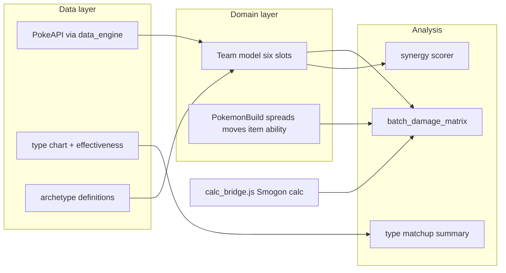

# PokeJarvis: data, teams, damage matrix, synergy

## What you already have

- **[data_engine.py](data_engine.py):** Cached PokeAPI access—base stats, types, abilities, Gen 9 learnsets (`get_base_stats_types_abilities`, `get_moves_gen9`).
- **[smogon_calc.py](smogon_calc.py) / [calc_bridge.js](calc_bridge.js):** Official `@smogon/calc` damage for **one** attacker, **one** defender, **one** move; optional **`field`** JSON for weather/terrain (needed for Rain/Sun accuracy).
- **[Jarvis_engine.py](Jarvis_engine.py):** Python-facing `calc_damage` / `damage_calc` with noisy prints; **[check_pkmn.py](check_pkmn.py):** CLI lookup.

## Target architecture

## Decisions to fix early (defaults if you do not specify)

- **Format:** Default to **Gen 9, Level 50 doubles-oriented** builds for damage examples (VGC-like); keep OU singles possible by swapping level/spreads and `field` (single-target assumptions). All batch helpers should take **level + format hint** as parameters.
- **“Accurate damage”:** Means **explicit builds** (species, ability, item, nature, EVs/IVs, moves) passed into `run_smogon_calc`, not species-only. Provide **library defaults** per species (e.g. common spreads from placeholders first; optional later: import Smogon sets).

---

## Phase 1 — Unified “Pokémon data on request” API

- Add a small module (e.g. `pokedex_service.py` or extend `data_engine.py`) that returns one structured dict: stats, types, abilities, **and** Gen 9 move list—single entry point for the agent/CLI.
- Optionally add PokeAPI **`type`**/`type/{id}` fetch + cache for **type chart** (damage relations), or ship a **static Gen 9 type chart JSON** in-repo to avoid extra HTTP and guarantee offline weakness math.

**Touches:** [data_engine.py](data_engine.py) (or new file), thin wrapper used by [check_pkmn.py](check_pkmn.py) / future CLI.

---

## Phase 2 — Team model and serialization

- Define **`PokemonBuild`** (species, level, ability, item, nature, evs, ivs, moves[4], tera optional if gen supports in calc).
- Define **`Team`** (exactly 6 `PokemonBuild` slots + metadata: name, archetype tag).
- JSON schema or dataclasses + `to_smogon_payload(side)` helper that maps each slot to the dict shape expected by [calc_bridge.js](calc_bridge.js) (`species` / options).

**Touches:** new `team_models.py` (or `jarvis_team.py`).

---

## Phase 3 — Archetype-based team construction (Rain, Sun, …)

- Add **`archetypes/`** (JSON/YAML): each archetype lists **roles** (setter, abuser, glue, hazard, speed control) and **candidate species** (manually curated first—fastest path to quality).
- Implement **`build_team(archetype_id, constraints)`**: picks candidates per role (simple scoring: required abilities/moves present in `get_moves_gen9`, type synergy with Phase 4 weights). Start **deterministic** (seeded random or fixed picks); avoid ML initially.
- Wire **weather** into suggestions: Rain → Drizzle users + Swift Swim / Bolstered Water moves; Sun → Drought + Chlorophyll / Fire abuse—validated against learnsets from [data_engine.py](data_engine.py).

**Touches:** new `team_builder.py`, data files under `archetypes/`.

---

## Phase 4 — Batch damage + opponent weaknesses

- **`damage_matrix(team_a, team_b | opponent_builds, context)`:** For each attacker slot and chosen offensive move vs each defender slot, call existing **`run_smogon_calc`** (consider **`async`/thread pool** or subprocess batching for latency). Respect **`field`** when archetype is weather-based.
- **`weakness_profile(species_or_build)`:** From types (and eventually ability quirks), compute multipliers vs common offensive types using the type chart from Phase 1.
- Output shape: tables (CSV/dict) + human-readable summary for the agent.

**Touches:** new `battle_analysis.py`; reuse [smogon_calc.py](smogon_calc.py) (prefer silent path—see Phase 6).

---

## Phase 5 — Synergy suggestions (heuristic v1)

- Score pairs/cores with explainable rules, e.g.: complementary typings (few shared weaknesses), offensive coverage adjacency, weather + abuser present, speed tier spacing (fast pivot + setup), duplicate-role penalties.
- Input: `Team` + optional opponent typings; output: ranked bullet reasons (strings), not black-box.

**Touches:** new `synergy.py`, consumed by CLI or `Jarvis_engine`.

---

## Phase 6 — Integrate into Jarvis entrypoint and UX

- Extend **[Jarvis_engine.py](Jarvis_engine.py)** (or add `pokejarvis_cli.py`) with commands: `lookup <name>`, `team build rain`, `analyze <team.json> vs <opponent.json>`, `synergy <team.json>`.
- **Quiet vs verbose:** gate/remove unconditional `print` in [Jarvis_engine.py](Jarvis_engine.py); use `logging` or a `verbose=` flag so batch runs stay usable.
- **Docs:** short “Agent runbook” (user asked not to add unsolicited markdown unless needed—keep to one **`AGENTS.md`** or README section only if you want the agent to follow steps).

---

## Risks and mitigations

| Risk | Mitigation |
|------|------------|
| PokeAPI rate limits | Keep `.poke_cache`; batch builder runs offline after cache warm |
| argv JSON size for calc | Payloads per Pokemon are small; if limits hit, fallback to temp file + bridge flag (future) |
| “Accurate” without real spreads | Document required fields; ship minimal **default spreads** and improve later |
| Doubles vs singles | Pass correct `field` and document move targets (bridge is primarily singles-oriented—confirm `@smogon/calc` doubles nuances in docs) |

---

## Suggested implementation order for an agent run

1. Phase 1 (type chart + unified lookup)  
2. Phase 2 (team/build models)  
3. Phase 4 skeleton (matrix API with 1–2 moves per mon manually)  
4. Phase 3 (one archetype end-to-end, e.g. Rain)  
5. Phase 5 + Phase 6 polish  
