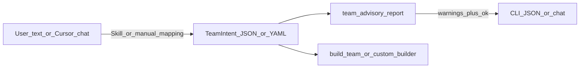

# Team recommendations, restrictions, and advisory warnings

## Current baseline

- **[`synergy.py`](/Users/ramisherif/Documents/Coding/Cursor /Project_PokeJarvis/synergy.py)** already emits doubles-oriented hints and optional **`opponent_type_pairs`** exposure checks (attack types vs your typings). It does **not** model named threats (e.g. Flutter Mane), **move priority**, **Armor Tail**, or **speed tiers**.
- **[`battle_analysis.py`](/Users/ramisherif/Documents/Coding/Cursor /Project_PokeJarvis/battle_analysis.py)** / **`type_effectiveness.py`** give per-species weakness profiles from typings only.
- **[`data_engine.get_base_stats_types_abilities`](/Users/ramisherif/Documents/Coding/Cursor /Project_PokeJarvis/data_engine.py)** exposes **`stats`** including **`speed`** base stat—enough for **heuristic** speed warnings (not true Speed ties without full EV/Nature math).

## Recommended architecture

Separate **structured constraints** (machine-readable) from **natural language** (human/Cursor), so warnings stay testable and reproducible.

## 1. Structured input schema (`TeamIntent`)

Add a small module e.g. **[`team_intent.py`](/Users/ramisherif/Documents/Coding/Cursor /Project_PokeJarvis/team_intent.py)** (or JSON Schema doc only) defining:

- **`preset_id`**, **`legendary_policy`**, **`mechanics_only_mega`** (align with existing [`pokejarvis_cli.py`](/Users/ramisherif/Documents/Coding/Cursor /Project_PokeJarvis/pokejarvis_cli.py) / [`team_constraints.py`](/Users/ramisherif/Documents/Coding/Cursor /Project_PokeJarvis/team_constraints.py)).
- **`must_include`**: list of partial slot stubs (`species`, optional `moves`, `ability`, `item`)—your “recommendations”.
- **`avoid_species`** / **`avoid_types`** (optional soft bans).
- **`meta_threats`**: list of species names to evaluate (e.g. `flutter-mane`, `meowscarada`, `greninja`, `farigiraf` for Armor Tail context).
- **`assume_field_opponent`** (optional): e.g. `{ "lead_species": "Farigiraf", "assume_armor_tail_active": true }` for priority-block scenarios.

Load via **`TeamIntent.from_json(path)`** / **`from_yaml`** (YAML optional dependency—if you want zero deps, JSON-only is fine).

## 2. Deterministic advisory engine (`team_advisory.py`)

New module callable from CLI and **`Jarvis_engine`**:

### A. Threat typing lanes (e.g. “Garchomp weak to Flutter Mane”)

For each **`meta_threat`** species:

- Resolve typings via existing **`get_base_stats_types_abilities`** (cached PokeAPI).
- For each slot on your **draft team** (from partial `Team` built from `must_include` + empty placeholders if incomplete), compute offensive effectiveness of **each threat attacking type** against your slot’s types using existing **`type_effectiveness`** helpers (same pattern as [`synergy.analyze_synergy`](/Users/ramisherif/Documents/Coding/Cursor /Project_PokeJarvis/synergy.py) lines 85–97 but **direction flipped**: threat types as “attack types”, your mon as defender).

Emit structured warnings when **max multiplier ≥ 2** for any threat type vs any slot, with message text like: **`Flutter Mane’s Fairy/Ghost typings threaten slot X (Garchomp) via Fairy STAB`**.

**Limitation (explicit in docstrings):** this is **typing/STAB lane** heuristics, not coverage of actual movesets or EV spreads.

### B. Armor Tail vs priority moves

- Add **`data_engine.get_move_battle_metadata(move_name)`** (cached): GET [`/api/v2/move/{name}`](https://pokeapi.co/docs/v2#moves-section)—field **`priority`** (game priority bracket). Treat **`priority > 0`** as “increased priority” for doubles advisory purposes (matches common usage for Fake Out / Grassy Glide–class interactions at a coarse level).
- If **`assume_armor_tail_active`** or opponent lead species has ability **Armor Tail** (from PokeAPI pokemon → abilities), scan your draft slots’ **`moves`** via **`move_slot_display`**; flag moves with **`priority > 0`** as **potentially blocked**.

Static fallback list optional if API fails (small curated set: Fake Out, Mach Punch, etc.)—keep minimal.

### C. Speed vulnerability (e.g. Meowscarada / Greninja)

Heuristic using **base Speed** from PokeAPI:

- Compute **`max_base_spe`** among your draft slots vs each **`meta_threat`** `speed` base stat.
- If threat base Speed exceeds yours by a configurable margin (e.g. ≥20 or ≥30) **and** threat has an attacking type that hits one of your slots for ≥2×, compose a **combined** warning (“fast Physical Dark threat may outspeed and threaten …”).

Optional refinement: if slot has **`evs.spe`** and **`nature`** parsed, approximate tier labels (`fast`, `slow`)—still not full damage calc.

### D. Integration with existing validators

After advisory, call **`validate_team_rules`** on any **`Team`** you can materialize from intent (partial teams may skip until slots filled—document behavior).

## 3. “Text command” input—practical v1 vs future

**v1 (no API keys, testable):**

- CLI: **`pokejarvis coach --intent path/to/intent.json`** printing **`{ "warnings": [...], "severity": ..., "intent_echo": ... }`**.
- **Cursor / ChatGPT workflow:** add a **Skill or Rule** (see repo [`.cursor/skills`](/Users/ramisherif/.cursor/skills-cursor) patterns you already use) that says: *when the user states constraints in prose, emit `TeamIntent` JSON matching the schema and run `python pokejarvis_cli.py coach --intent …`*. That satisfies “AI proceeds from text” **using the IDE agent** as the NL parser.

**v2 (optional):** embed OpenAI/etc. behind **`coach --prompt`**—only if you explicitly want in-repo LLM parsing and API keys.

## 4. Wiring

- **[`pokejarvis_cli.py`](/Users/ramisherif/Documents/Coding/Cursor /Project_PokeJarvis/pokejarvis_cli.py):** new **`coach`** subparser with **`parents=[common]`**, **`--intent`**, optional **`--partial-team-json`** to merge intent with an existing draft team file.
- **[`Jarvis_engine.py`](/Users/ramisherif/Documents/Coding/Cursor /Project_PokeJarvis/Jarvis_engine.py):** export **`load_team_intent`**, **`team_advisory_report`** (names illustrative).
- **`MECHANICS.md` or short `COACH.md`:** schema examples + threat list usage + limitations.

## 5. Tests

Add **`tests/test_team_advisory.py`** with **`unittest.mock`** patching **`get_base_stats_types_abilities`** / **`get_move_battle_metadata`** to avoid network:

- Garchomp slot + Flutter Mane threat → expect Fairy-related warning.
- Slot with Fake Out + Armor Tail assumed active → priority warning.
- Slow team vs fast threat with super-effective type → combined warning.

## Out of scope (unless you expand later)

- Full damage calc vs sample sets for every threat (could reuse **`damage_matrix`** against a synthetic opponent team—heavy).
- Perfect Speed tiers without simulating EV/Nature/abilities (Protosynthesis, Tailwind, etc.).
